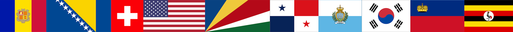

# Geografi-spill

Dette spillet er min besvarelse på en semesteroppgave i emnet [objektorientert programmering](https://www.uib.no/emne/INF101) ved Universitetet i Bergen.

## Hvordan spille spillet

Spillet kjøres gjennom Main.java.

[Se demonstrasjon av spillet her](https://youtu.be/RN05-25zqeQ)

Når du starter spillet blir du presentert med en meny. Her velger du verdensregionen du har lyst å spille med. Når du velger en region vil du igjen bli presentert med en meny der du får valget mellom å spille et flagg-spill og et hovedstad-spill.

**Flagg-Spill**
I flagg-spillet blir du presentert med ett land, for eksempel Spania, som du skal gjette. Du får da fire alternativer som alle er bilder av ulike flag. Du skal trykke på det flagget som du tror er Spania. Dersom du valgte Europa som verdensdel, vil du kun bli presentert med land og flagg fra Europa. Du får ett poeng for hvert flagg du velger som er korrekt og null poeng dersom flagget du velger er feil. Når spillet er over får du en score.

**Hovedstad-Spill**
I hovedstad-spillet blir du presentert med ett land, for eksempel Norge, som du skal gjette. Du får da fire alternativer som alle er ulike hovedsteder. Du skal trykke på den hovedstaden som du tror er hovedstaden til Norge. Dersom du valgte Europa som verdensdel, vil du kun bli presentert med land og hovedsteder fra Europa. Du får ett poeng for hver hovedstad du velger som er korrekt og null poeng dersom hovedstedet du velger er feil. Når spillet er over får du en score.

Du kan gå ut av spillet og tilbake til hovedmenyen ved å trykke på "escape" knappen.

## Merknader
Alle land i dette spillet er hentet fra [Wikipedias liste over suverene stater](https://no.wikipedia.org/wiki/Liste_over_hovedsteder_etter_land). Alle verdensdeler har blitt lagt inn manuelt og det taes forbehold om at det kan forekomme feil i forbindelse med verdensdelene.

## Kilder
Alle bilder brukt i dette spillet er hentet fra [Store Norske Leksikon](https://snl.no/).
